# MegKnob 开发日志与路线图

> 排列规则：路线图置顶；开发日志按**倒序时间**排列，新的记录在前，旧的记录在后。

# 目标与路线图

## 短期目标：恢复键盘输入能力，并重新启用无线蓝牙

### 目标定义

在保留当前 24 通道磁轴扫描能力的前提下，把 MegKnob 从“仅 USB CDC 的采集仪”恢复为可日常使用的 ZMK 键盘：

1. USB 连接时能够发送标准 USB HID 键盘报告；
2. 电池供电时能够通过 BLE HID 配对、连接、输入和重连；
3. 将滚轮 A/B 两相改为正交编码器输入，彻底解决一次旋转同时触发两个方向的问题，同时保留滚轮按下；
4. 建立一个基于 Chromium Web Serial 的网页上位机 MVP，至少支持实时波形、设备信息和基础参数读写；
5. 点亮预留的 0.91 寸 128×32 OLED，并显示连接方式、蓝牙 profile、层和基础状态；
6. 现有 Hall 扫描不出现明显降速、误触发或任务饥饿；
7. USB CDC 调试流作为开发功能保留，但不能阻塞 HID 与 BLE；
8. 所有恢复动作分阶段进行，每一步都保留可回退的稳定基线。

### 当前起点

- 24 通道完整扫描实测约 **1216 Hz**，平均周期约 **0.822 ms**；
- ADC 主体采用 3 片 74HC4051、8 个 Gray-code 地址、每地址一次三通道 SAADC batch read；
- `kscan_adc_mux` 已经通过 ZMK `kscan_callback_t` 上报 `row/col/pressed`，输入事件链本身已经存在；
- 固件当前显式设置 `CONFIG_ZMK_USB=n`、`CONFIG_ZMK_BLE=n`、`CONFIG_BT=n`；
- `megknob.keymap` 当前全部为 `&none`，所以即使扫描产生位置事件，也不会形成键码；
- USB CDC、协议 v3 和上位机当前稳定；
- 滚轮按下位置 19 目前同时被 Hall viewer 模式监听器使用，恢复按键前必须处理功能冲突；
- 滚轮旋转 A/B 两相当前被错误建模为两个普通矩阵键，单方向旋转时两个触点先后变化，因此会同时触发两个方向；这不是简单换键码能修复的问题，必须使用正交状态机解码；
- PCB 预留 0.91 寸 128×32 OLED；仓库尚无 MegKnob 屏幕节点，但 nice_nano 的标准 I2C 引脚 P0.17/SDA 与 P0.20/SCL 当前未被 MegKnob 占用；
- 当前桌面上位机已经证明协议 v3 可稳定传输实时波形，但还没有网页配置器，也没有设备端参数写入命令；
- 当前固定阈值是按下 `< 900 mV`、释放 `> 1400 mV`、连续 3 次扫描确认。

### 实施原则

- **先修滚轮输入模型，再恢复完整键位**：正交编码器属于基础输入设备，应在全键 HID 验收前解决，避免把错误的 A/B 矩阵模型带进日用固件。
- **先 USB HID，后 BLE HID**：先验证扫描事件、矩阵位置和键码，不把 USB、BLE、功耗问题同时引入。
- **网页端先复用现有协议，再做统一 RPC**：第一版 Web UI 直接解析 v3 实时流；参数写入协议和 ZMK Studio 共存方案在基础链路稳定后演进。
- **OLED 最后接入主流程**：先独立点亮和确认引脚，再在 BLE/HID 稳定后加载状态 widget，避免显示栈干扰输入问题定位。
- **先固定触发，后高级磁轴算法**：第一版 HID 沿用当前稳定阈值；Rapid Trigger 单独迭代。
- **遥测不能阻塞输入**：CDC 队列满时继续丢弃旧数据；HID/BLE 的输入实时性高于波形完整性。
- **默认限制扫描频率**：1216 Hz 是性能余量而不是必须长期满速运行的目标。恢复 BLE 后优先尝试稳定在约 1000 Hz，为协议栈和射频调度留出 CPU 时间。
- **每阶段都有验收与回退点**：每次只引入一个主要变量，保留对应 UF2、配置和测试结果。

### 阶段 0：冻结采集基线和测试方法

**工作内容**

1. 保存当前“仅 CDC”固件作为已知良好基线；
2. 记录当前 UF2、Git 提交、设备树参数和协议版本；
3. 使用相同测试方法记录 10 分钟基线：scan rate、RX fps、CRC、设备/GUI 丢帧、抖动、显示延迟；
4. 保存静置、单键快速按压、多键同时按压三组数据；
5. 建立最小键盘验收表：每个物理键、对应 `RC(row,col)`、预期键码、是否会与 viewer 功能冲突。

**验收标准**

- 连续运行 10 分钟无崩溃；
- CRC 错误为 0；
- 关键模拟指标和当前 1216 Hz 结果有记录，可用于之后对照。

**回退点**

- 当前纯采集 UF2。

### 阶段 1：将滚轮旋转迁移为正交编码器

**问题结论**

当前 `kscan_wheel` 是 1×3 GPIO 矩阵：P1.00 为按下，P0.11 与 P0.24 分别接编码器 A/B 相。机械编码器每次转动时 A、B 两相都会依次翻转；把它们当成两个普通键时，一次旋转必然可能产生两个位置事件。正确方向只能由 `00 → 01 → 11 → 10` 或反向序列判断，因此需要 ZMK 的 `alps,ec11` 正交解码器。

**工作内容**

1. 先用逻辑分析仪或 GPIO 日志确认滚轮型号、静止电平、A/B 相顺序、每格脉冲数和是否需要 `GPIO_ACTIVE_LOW | GPIO_PULL_UP`；
2. 在 overlay 中把 P0.11 与 P0.24 从 `kscan_wheel` 移出，新增 `compatible = "alps,ec11"` 的 encoder sensor；
3. 保留 P1.00 与 P1.11 组成的滚轮按下矩阵，把原 1×3 wheel kscan 缩减为只包含按下的 1×1 矩阵；
4. 新增 `zmk,keymap-sensors` 节点，并根据实际每圈脉冲数设置 `steps` 与 `triggers-per-rotation`，不能未经测量直接照抄示例的 80/20；
5. 在 `megknob.conf` 启用 `CONFIG_EC11=y` 与 `CONFIG_EC11_TRIGGER_GLOBAL_THREAD=y`；
6. 在 keymap 中通过 `sensor-bindings = <&inc_dec_kp ... ...>` 分别绑定顺时针和逆时针行为；
7. 第一次测试只输出 encoder delta 日志，不立即绑定音量或滚动，先确认单方向始终只有同符号 delta；
8. 处理 transform：滚轮 A/B 不再占用键位，物理布局只保留滚轮按下；同时更新 `MEG_MAPPING.md` 中对应说明。

**验收标准**

- 顺时针连续 100 格只产生顺时针事件，逆时针连续 100 格只产生逆时针事件；
- 慢转、快转、半格返回和轴体抖动均不产生反向幽灵事件；
- 每个机械刻度触发次数稳定，不丢步也不重复；
- 边按滚轮边旋转时，按下和旋转可独立工作；
- 滚轮按下位置仍能进入 ZMK keymap，且日用固件不再同时切换 Hall viewer 模式。

**回退点**

- 保留按下可用、旋转暂时禁用的固件；不要回退到把 A/B 相当普通键发送的错误模型。

### 阶段 2：先恢复 USB HID，保持 BLE 关闭

**工作内容**

1. 在 `megknob.conf` 中只开启 ZMK USB HID：把 `CONFIG_ZMK_USB` 改为 `y`，继续保持 `CONFIG_ZMK_BLE=n` 与 `CONFIG_BT=n`；
2. 保留 `CONFIG_USB_DEVICE_STACK=y` 与 `CONFIG_USB_CDC_ACM=y`，验证设备能否作为 USB 复合设备同时暴露 HID 与 CDC ACM；
3. 如果出现 USB endpoint、接口描述符或初始化冲突，优先保证 HID，暂时将 CDC 做成可选构建配置，而不是修改 Hall 扫描逻辑；
4. 把 `megknob.keymap` 从全 `&none` 改为最小测试层：先只启用 1 个磁轴键和滚轮按下位置，旋转行为通过 `sensor-bindings` 单独验证，其余仍为 `&none`；
5. 使用按下 `< 900 mV`、释放 `> 1400 mV` 的现有固定阈值验证完整链路：
   `ADC → kscan callback → position event → keymap → USB HID report`；
6. 确认单键正确后，再按 `MEG_MAPPING.md` 分批恢复全部物理键位；
7. 最后启用滚轮按下与 encoder `sensor-bindings`，并确认位置 19 的 viewer mode 切换不会同时发送非预期键码。

**位置 19 冲突处理**

生产键盘中不应让滚轮按下既切换 viewer 模式又发送键码。建议把 `hall_stream_mode_listener` 变成调试构建专用功能：

- 调试固件：位置 19 可切换 U26/U27/U28/ALL 显示；
- 日用固件：关闭该监听器，让位置 19 完全交给 keymap；
- 不建议在生产固件中依靠“忽略事件”掩盖冲突，因为监听器当前会继续 bubble，两个动作仍可能同时发生。

**USB HID 验收标准**

- 系统同时识别键盘 HID 与 CDC 串口；
- 所有已启用键位按下、保持、释放均正确；
- 连续快速点击、慢速越过阈值、两键及多键同时按下无卡键；
- NKRO/6KRO 行为符合 ZMK 当前配置；
- CDC 上位机仍可连接，CRC 为 0；
- 开启 HID 后扫描率建议不低于 950 Hz，且不出现持续队列积压；
- USB 拔插 30 次无描述符异常、无卡死、无幽灵键。

**回退点**

- 单键 HID 测试固件；
- 全键 USB HID、BLE 关闭的稳定固件。

### 阶段 3：降低运行压力，为 BLE 留出确定的调度余量

**工作内容**

1. 将扫描循环由“无上限连续运行”改为约 1000 Hz 的明确预算，目标完整周期约 1 ms；
2. 保留 3 µs acquisition 和 10 µs settle 的前提下，优先通过扫描节拍控制限频，不继续牺牲模拟建立时间；
3. 测量开启 USB HID 后的 `scan/address/adc/process` 分段耗时；
4. 检查 CDC TX IRQ、ZMK 输入线程、USB HID 报告之间是否存在同优先级饥饿；
5. 确认消息队列仍采用“满时丢最旧帧”，任何遥测堵塞都不能拖慢按键事件。

**验收标准**

- 扫描稳定在目标频率附近，而不是在 800–1200 Hz 间大幅漂移；
- 输入延迟和抖动可重复；
- HID 高频连击期间 CDC 可以丢旧帧，但按键不能卡住。

### 阶段 4：恢复 BLE 编译与最小无线按键

**工作内容**

1. 在 USB HID 已稳定的基线上启用 `CONFIG_ZMK_BLE=y` 与 `CONFIG_BT=y`；
2. 第一版 BLE 测试仍只启用少量键，减少故障定位范围；
3. 保留 settings/NVS，验证配对信息能够持久保存；
4. 增加明确的蓝牙 profile 操作键：选择 profile、清除配对、切换输出；
5. 分别测试以下启动场景：
   - USB 已连接后启动；
   - 纯电池启动；
   - 已配对主机自动重连；
   - 未配对时进入可发现状态；
   - USB 与 BLE 同时可用时切换输出；
6. 纯电池启动时 USB CDC 没有 DTR，确认 stream thread 不会阻塞、忙循环或影响 BLE；
7. 如果 CDC 设备节点在无 USB 供电场景造成初始化问题，将 Hall stream 做成编译期开关，准备“日用无线固件”和“有线诊断固件”两个配置，而不是强迫无线模式携带完整遥测。

**BLE 最小验收标准**

- 能在 Windows、macOS 或手机至少两类主机上发现并配对；
- 断开后能够自动重连；
- 重启后 bonding 信息仍在；
- profile 切换与 clear bonding 可用；
- 连续输入 30 分钟无卡键、重复键或连接断开；
- BLE 工作时扫描保持约 1000 Hz，或至少稳定高于产品最终需要的频率；
- 无线输入延迟与 USB 基线差异有实测记录。

**回退点**

- USB HID 稳定固件；
- BLE 单键测试固件。

### 阶段 5：建立网页上位机 MVP 与配置协议

**GitHub 方案调研结论**

成熟键盘网页工具大致分为两类，但没有一个项目可以直接满足“ZMK + 磁轴逐键参数 + 实时波形”：

| 方案 | 地址 | 可借鉴内容 | 对 MegKnob 的限制 |
|---|---|---|---|
| ZMK Studio | <https://github.com/zmkfirmware/zmk-studio> / <https://zmk.studio/> | 官方 ZMK 运行时 keymap 编辑、USB 串口与 BLE 配置入口 | 当前不支持磁轴校准、触发点、Rapid Trigger 和实时波形，也不能直接把自定义页面注入官方 UI |
| ZMK custom Studio RPC 模板 | <https://github.com/cormoran/zmk-module-template-with-custom-studio-rpc> | 自定义固件 RPC 与 Web 客户端的工程范式 | 需要为 MegKnob 设计自己的 RPC 与 UI，不能直接获得成品配置器 |
| VIA | <https://github.com/the-via/app> | 成熟 WebHID 配置器架构和键位编辑 UX | 面向 QMK/VIA，不兼容 ZMK |
| Vial | <https://github.com/vial-kb/vial-gui> | 动态 keymap、宏和参数编辑 UX | 面向 QMK/Vial，不兼容 ZMK |
| ZMK keymap-editor | <https://github.com/nickcoutsos/keymap-editor> | ZMK keymap 的网页编辑体验 | 主要编辑配置文件，不是连接设备的磁轴实时工具 |
| Wootility / Keychron Launcher | 厂商网页或桌面工具 | 逐键触发、RT、校准和实时曲线的产品交互参考 | 核心实现闭源，只能参考 UX，不能复制代码 |

推荐采用**双轨架构**：

1. 通用键位、层和 behavior 优先接入官方 ZMK Studio；
2. 磁轴专用功能开发独立的 MegKnob Web Configurator；
3. 第一版 Web Configurator 通过 Chromium Web Serial 直接复用现有 USB CDC v3 数据流；
4. 后续为参数写入定义双向命令/RPC，再评估与 ZMK Studio RPC 共用一个端点、复合 CDC 或区分诊断/日用构建；
5. VIA/Vial 不作为固件协议基础，只参考其 UI 结构；Wootility/Launcher 只参考磁轴操作流程。

**MVP 功能范围**

1. 浏览器连接/断开串口，显示固件版本、协议版本和设备状态；
2. 解析现有 62-byte v3 数据帧，绘制 24 路实时波形；
3. 通道分组、显示开关、当前 mV、min/max/均值/峰峰值；
4. 显示 scan rate、RX fps、CRC、序号丢帧和 GUI 丢帧；
5. 导出 CSV 和导入回放；
6. 设备命令先定义最小集合：读取配置、写入配置、保存到 NVS、恢复默认值、开始/停止遥测；
7. 参数页第一版支持全局 press/release threshold 和 stable scan count，逐键校准及 RT 留到长期目标；
8. 明确支持 Chrome/Edge；Safari 与 Firefox 因 Web Serial 支持限制不作为第一版目标。

**协议设计原则**

- 保留现有 v3 DATA/MODE/PERF 帧以避免破坏稳定采集链路；
- 新增主机到设备命令时必须包含 magic、version、command、payload length、request id 和 CRC；
- 读取与写入都要有明确 ACK/NACK、错误码和当前配置版本；
- RAM 中试用与 NVS 持久化分开，避免拖动滑块时频繁写 Flash；
- 参数必须有合法范围，设备端负责最终校验，网页端校验不能代替固件校验；
- 协议解析和绘图放在 Web Worker，UI 线程只接收批量结果；
- 实时数据继续采用有界缓存和丢旧策略，参数命令则必须可靠应答，二者不能共用同一种丢弃语义。

**与 ZMK Studio 的集成步骤**

1. USB HID 与 BLE 稳定后，单独构建 ZMK Studio 实验固件；
2. 使用 `studio-rpc-usb-uart` snippet 和 `CONFIG_ZMK_STUDIO=y`；
3. 验证 MegKnob 已有 physical layout 能被 Studio 正确识别；
4. 评估 Studio 增加的 Flash/RAM、CDC endpoint 和当前 Hall stream 的冲突；
5. Studio 与 Hall stream 冲突时，不在未设计 framing 的情况下把两种协议直接写进同一个字节流；优先选择独立接口，或明确的统一多路复用协议；
6. `&studio_unlock` 只放在功能层，避免设备长期处于可写状态。

**验收标准**

- Chrome/Edge 能稳定连接、断开、重新连接；
- 连续显示 ALL 24 CH 30 分钟，无内存持续增长和明显历史积压；
- Web 端 CRC、序号和数值结果与 Python 上位机一致；
- 参数读取、临时应用、保存、重启恢复和恢复默认值全流程通过；
- 网页断开或崩溃不会阻塞 HID/BLE，也不会让设备停留在未定义配置；
- 固件拒绝越界值、错误 CRC、未知版本和重复 request id。

### 阶段 6：恢复完整键位与输出切换

**工作内容**

1. 按 `MEG_MAPPING.md` 恢复全部确认存在的磁轴键；
2. 恢复滚轮按下与旋转绑定；
3. 设计至少一个功能层，放置蓝牙 profile、清除配对、USB/BLE 输出切换、RGB 和调试功能；
4. 检查物理布局目前只有 MEG0–MEG18 的实际映射，不把 24 个采样槽位误当成 24 个都已安装的按键；
5. 做逐键 pressed/released 日志，核对矩阵位置、键帽标识和发送键码；
6. 验证 USB 与 BLE 切换期间不会残留 modifier 或卡住普通键。

**验收标准**

- 全键矩阵与预期布局一致；
- 每个 modifier 与多键组合正确；
- 输出切换前主动释放旧端点的按键状态；
- 位置 19 不再触发 viewer mode 冲突。

### 阶段 7：点亮并集成 0.91 寸 128×32 OLED

**当前事实与信息缺口**

- MegKnob 仓库目前没有 OLED、SSD1306 或 I2C 屏幕节点；
- nice_nano 标准 `pro_micro_i2c` 使用 P0.17/SDA 和 P0.20/SCL，这两个引脚未被当前 MegKnob overlay 占用，代码层面暂未发现冲突；
- 仓库中的 `knob_goblin` 是最接近的成熟范例：同时使用 EC11 与 128×32 SSD1306；
- 在写设备树前仍需人工确认屏幕控制器确为 SSD1306、I2C 地址是 0x3C 还是 0x3D、供电电压、接口引脚顺序、是否有 Reset 引脚，以及 PCB 预留是否确实连接到 P0.17/P0.20；
- “0.91 寸、128×32”不能单独证明控制器和地址，不能直接据此焊接或套用 overlay。

**实施顺序**

1. 核对 OLED 模块背面丝印、数据手册、PCB 原理图和连接器 pinout；
2. 断电测量 VCC/GND/SDA/SCL 连通性，确认没有和现有 GPIO 复用；
3. 用 I2C 扫描或最小固件确认设备地址；
4. 在 MegKnob overlay 中启用 `&pro_micro_i2c`，添加 `solomon,ssd1306fb` 128×32 节点，并设置 `zephyr,display`；
5. 在 `Kconfig.defconfig` 中按 `app/boards/shields/knob_goblin/` 的范例按需启用 I2C、SSD1306 和 1-bit LVGL；
6. 第一版只做清屏、全亮、像素/文字测试，不同时启用 BLE 和复杂 widget；
7. 第二版启用 ZMK built-in status screen，先显示 layer 和 output；
8. BLE 与电池报告稳定后再显示 profile、连接状态和电量；
9. 如果内置布局不适合 128×32，再实现 MegKnob custom status screen；
10. 增加 blank-on-idle，避免 OLED 烧屏并降低无线功耗。

**建议的 128×32 信息布局**

- 左侧：当前层或功能模式；
- 中间：USB / BLE 图标与 profile 编号；
- 右侧：电量；
- 临时覆盖提示：配对、清除 profile、保存参数、校准成功/失败；
- 不建议在 128×32 屏上持续绘制 24 路波形，实时波形交给网页上位机。

**性能与功耗测试**

- 分别测量屏幕关闭、静态状态页、频繁刷新三种情况下的 scan rate、BLE 稳定性和电流；
- 状态没有变化时不应持续重绘；
- 比较 OLED blank 前后的静置功耗；
- 同时关注 WS2812，当前 RGB 的功耗通常比 128×32 OLED 更高，续航优化不能只盯屏幕。

**验收标准**

- 冷启动、USB 启动和电池启动均能可靠初始化屏幕；
- 显示方向、偏移和像素无错位，不闪烁、不随机花屏；
- 层、USB/BLE 输出和 profile 状态与真实状态一致；
- 屏幕更新不造成 Hall scan 持续低于目标频率，也不导致 BLE 掉线；
- idle 后按预期熄屏，输入或状态变化后恢复；
- 连续运行 8 小时无 I2C 错误、死锁或显示停止更新。

### 阶段 8：恢复电池、功耗与无线稳定性

**工作内容**

1. 核对硬件是否具有可用的电池电压采样节点，再决定是否启用 `CONFIG_ZMK_BATTERY_REPORTING`；当前 overlay 未看到明确 `zmk,battery` 节点，不能只打开 Kconfig 就假设电量准确；
2. 测量三种状态功耗：BLE 广播、BLE 已连接静置、持续输入；
3. 评估 RGB、1000 Hz ADC 连续扫描和 USB CDC 代码对续航的影响；
4. 设计空闲分级：活跃时高扫描率、短空闲降低扫描率、长空闲进入 ZMK idle/sleep；
5. 当前 `CONFIG_ZMK_SLEEP=n`，恢复睡眠前必须验证 ADC mux 驱动的 enable/disable、唤醒源和首次采样是否可靠；
6. 检查 soft-off、唤醒按键、断电重启和低电量行为；
7. BLE 压力测试至少 8 小时，并进行多次超距断开/回到范围自动重连。

**验收标准**

- 无线长测不崩溃、不持续掉线；
- 睡眠唤醒后没有首键丢失、错误电压或卡键；
- 电量报告与万用表实测趋势一致；
- 给出可复现的续航估算，而不是只记录瞬时电流。

### 阶段 9：短期目标完成判定

满足以下条件后，才把“短期日用化目标”标记为完成：

- USB HID 与 BLE HID 均可独立使用；
- USB CDC 调试模式不会影响键盘输入；
- 全部实际键位、滚轮按下、正交旋转、modifier 和多键组合通过测试；
- 配对、重连、profile、输出切换和清除配对均可恢复；
- 网页上位机能够稳定显示 v3 实时波形并完成基础参数的读取、临时应用、持久化和恢复默认值；
- OLED 能可靠显示层、输出和 profile 状态，且 idle blank、功耗与长时间稳定性通过；
- 至少一次 8 小时 BLE/OLED 稳定性测试和一次 10 分钟全通道波形对照通过；
- 有日用固件与诊断固件的明确构建方式；
- 有可回退的稳定 UF2 和对应 Git 版本。

## 长期目标：从“能输入”发展为完整的无线磁轴键盘平台

### 1. 逐键校准与统一行程模型

- 为每个实际磁轴键保存释放电压、按到底电压、方向、死区和噪声；
- 将不同传感器的毫伏值归一化为 0–100% 行程；
- 校准数据写入 settings/NVS，并提供恢复默认值和重新校准流程；
- 检测磁铁方向错误、传感器失效、动态范围过小和相邻通道串扰。

### 2. 可配置触发点与 Rapid Trigger

- 第一阶段实现固定行程触发点和独立释放点；
- 第二阶段实现 Rapid Trigger：根据局部极值和反向移动量动态触发/释放；
- 支持每键参数、最小变化量、噪声门限和安全滞回；
- 使用已录制波形做离线回归，再进入 HID 实机测试；
- 对慢按、快速连击、半程抖动、压住微动、多键同时动作建立自动测试集。

### 3. 网页配置器、运行时配置与诊断

- 形成正式的 MegKnob Web Configurator，采用响应式键盘布局、逐键选择和实时状态反馈；
- 将触发点、RT 灵敏度、校准、扫描率、RGB、OLED 和调试流开关做成可持久化配置；
- 通用 keymap/层/behavior 使用 ZMK Studio，磁轴参数与实时波形使用 MegKnob 专用页面；
- 参考 VIA/Vial 的设备连接和键位编辑流程，参考 Wootility/Keychron Launcher 的触发点、RT 与校准 UX，但不复制闭源实现；
- 为协议建立版本协商、能力发现、配置 schema 版本和迁移机制；
- 保留协议 v3 的诊断能力，并支持按需启动、通道选择或降采样，避免无线日用模式持续输出 62-byte 高频帧；
- 增加逐键校准向导、质量评分、波形回放、配置导入导出和一键恢复；
- 长期评估 PWA 与原生壳，使不支持 Web Serial/Web Bluetooth 的平台也能使用同一套前端。

### 4. OLED 产品化

- 为 128×32 单色屏设计 MegKnob 专用紧凑状态页；
- 支持层、USB/BLE 输出、profile、电量、Caps Lock、校准和错误提示；
- 采用事件驱动刷新和脏区域更新，避免无变化时持续渲染；
- 提供屏幕亮度、超时、翻转方向和关闭选项；
- 对烧屏、I2C 恢复、睡眠唤醒和固件升级状态建立测试；
- 将屏幕作为状态反馈，不承担 24 路实时波形显示。

### 5. 功耗自适应扫描

- 输入活跃时保持约 1000 Hz；
- 短时间静止后降低扫描频率；
- 更长空闲后关闭不必要外设并进入 ZMK sleep；
- 用唤醒后的快速预扫描避免第一键丢失；
- 在延迟、噪声、BLE 射频调度和续航之间形成量化策略。

### 6. 可靠性与可制造性

- 建立 24 通道开机自检：断路、短路、饱和、固定 0 V、动态范围异常；
- 针对 U28 这类焊接故障设计生产测试点和自动测试流程；
- 固化 PCB 版本、元件型号、传感器方向、4051 Enable 连接和 ADC 映射；
- 建立版本化固件、配置迁移和恢复机制；
- 最终形成可重复制造、校准、刷写和验收的完整流程。

---

# 开发日志（倒序）

## 2026-07-20：1000 Hz 目标达成

CDC 中断批量发送版本实测结果：

| 指标 | 实测值 |
|---|---:|
| Scan rate | **1216 Hz** |
| 平均完整周期 | **0.822 ms** |
| 周期抖动标准差 | **0.040 ms** |
| RX data frame rate | **1171 fps** |
| USB CDC 吞吐量 | **72907 B/s** |
| 设备扫描主体 `PERF scan_us` | **610 µs** |

吞吐量换算为 `72907 / 62 ≈ 1175.9` 个总帧/秒。固件每 256 次扫描额外发送一个 62-byte performance frame，扣除这部分后与上位机显示的 1171 个数据帧/秒基本一致，证明传输统计自洽。

CDC 从逐字节 `uart_poll_out()` 改为 TX 中断下整帧 `uart_fifo_fill()` 后，完整数据输出稳定跨过 1000 fps，主要传输瓶颈得到解决。Scan rate 1216 Hz 比目标高约 21.6%，0.822 ms 周期比 1.000 ms 预算保留约 178 µs，0.040 ms 抖动约占平均周期 4.9%。

`PERF` 从此前 562 µs 变为 610 µs 不代表 ADC 退化。批量 CDC 改变了扫描线程、USB workqueue 和中断之间的 CPU 竞争关系，测量期间可能被 USB 中断或更高优先级任务抢占。即使按 610 µs 计算，扫描主体理论上限仍约为 1639 Hz，无需继续绕过 Zephyr `adc_read()`。

下一阶段不再追求更高空载频率，优先验证模拟精度、限制目标运行频率、恢复 HID 与 BLE。

## 2026-07-20：CDC 批量发送优化

第二阶段初次实测：scan rate 约 888 Hz，RX 约 862 fps，吞吐量约 53710 B/s，设备端 `PERF scan_us` 约 562 µs。

`1,000,000 / 562 ≈ 1779 Hz`，说明地址切换、settle、八次 ADC batch read 和矩阵处理已经明显超过 1000 Hz。限制位于 CRC、封包、线程调度和 CDC 发送，而不是 4051 或 SAADC。

本地驱动检查确认：

- nRF SAADC 已通过 EasyDMA 将每个地址的三个通道搬运到 RAM；
- CDC ACM 内部已有 1024-byte TX ring buffer 和 USB bulk endpoint；
- 原发送线程对每个 62-byte 帧调用 62 次 `uart_poll_out()`，862 fps 时约为每秒 53444 次逐字节 API 调用。

优化后的发送路径：

1. 发送线程从消息队列取得一帧；
2. 将完整 62-byte 帧放入共享 TX frame 并启用 TX IRQ；
3. TX-ready 回调调用 `uart_fifo_fill()`，通常一次放入完整帧；
4. ring buffer 只能接受部分数据时保留 offset，下一次继续；
5. 完整帧入队后关闭 TX IRQ，并用 semaphore 唤醒发送线程。

该修改保持协议 v3、CRC、ADC 配置和上位机协议不变。构建成功，UF2 大小为 136192 bytes。

## 2026-07-20：冲击 1000 Hz，第二阶段候选固件

在保留协议 v3、12-bit、无过采样、三通道 ADC batch read 和 Gray-code 扫描的基础上继续压缩开销：

1. SAADC acquisition time 从 5 µs 降至 3 µs；
2. 4051 settle time 从 20 µs 降至 10 µs；
3. work handler 启动后连续扫描，不再每帧重新 reschedule；
4. 每轮完整扫描后执行一次 `k_yield()`，让同优先级 CDC 线程运行；
5. CRC 从逐 bit 算法改为 16 项 nibble 查表；
6. enable/disable 改用原子状态控制。

固件编译成功，UF2 大小为 135680 bytes。验收重点是扫描率、RX fps、`LOSS DEV/UI`、静止噪声、完全按下幅值和相邻通道串扰。3 µs acquisition 与 10 µs settle 均属激进配置，不能以错误采样换取频率数字。

## 2026-07-20：停止兼容 v2，升级协议 v3

旧版和新版固件曾共同使用协议 v2，但时间戳语义不同：第一版直接换算 32-bit、64 MHz DWT 值，约每 67.1 秒回绕；修复版发送 32-bit 微秒累计值，约每 71.6 分钟回绕。上位机只能猜测固件类型，存在误判风险，因此固件和上位机统一只支持 v3。

v3 时间处理：

1. 固件只换算相邻 DWT 读数之间的短周期差值；
2. 差值先转为纳秒，再累计进 64-bit `timestamp_ns`；
3. 线上发送 `timestamp_ns / 1000` 的低 32 bit，约 71.6 分钟自然回绕；
4. 上位机检测标准 uint32 回绕并精确增加 `2^32 µs`；
5. 删除旧版 67.1 秒启发式兼容逻辑，拒绝非 v3 帧。

升级后必须同时使用 v3 固件和新版上位机。

## 2026-07-20：长时间运行后时基缩短

### 现象

长时间传输后，可见波形范围明显缩短，甚至不足 100 ms；点击“清屏”后恢复。

### 根因

协议时间戳约每 71.6 分钟正常回绕，但旧版 67.1 秒 DWT 回绕兼容判断位于标准 uint32 判断之前。标准回绕被误判后，上位机只增加 `67,108,864 µs`，而不是 `4,294,967,296 µs`，导致展开时间倒退约 70 分钟，历史缓存残留“未来样本”。

### 修复

1. 优先检查向后跳变量是否大于 `0x80000000`，满足时按标准 uint32 回绕增加 `2^32`；
2. 只有不满足标准回绕时，才进入旧版兼容分支；
3. 随后通过协议 v3 完全删除歧义。

## 2026-07-20：第一阶段实测与上位机性能修复

第一阶段刷入后，完整 24 通道 scan rate 从约 695 Hz 提升至约 **800 Hz**。

发现的问题：

1. 运行一段时间后曲线逐渐稀疏，清屏后暂时恢复；
2. ALL 24 CH 模式 GUI 负载较高；
3. 原 `DISPLAY LAG` 混入 MCU/PC 时钟漂移，不具有可靠含义。

修复内容：

- 固件累计相邻 DWT 短差值，避免 DWT 自身约 67.1 秒回绕破坏时间轴；
- 历史缓存只保留当前时基约 110%；
- NumPy 转换前将绘图数据限制到约 1000 点，并保留最新点；
- 关闭全局抗锯齿，启用 `clipToView` 与 peak downsampling；
- 通道标签改为每 200 ms 更新，波形仍保持 25 FPS；
- 串口线程记录解码到达时间，`DISPLAY LAG` 改为 GUI 队列等待时间；
- `FRAME LOSS` 改为 `LOSS DEV/UI`，区分协议序号丢帧与 GUI 主动丢旧帧。

上位机语法、PyQt5 离屏窗口和固件构建均通过。

原始测试截图：

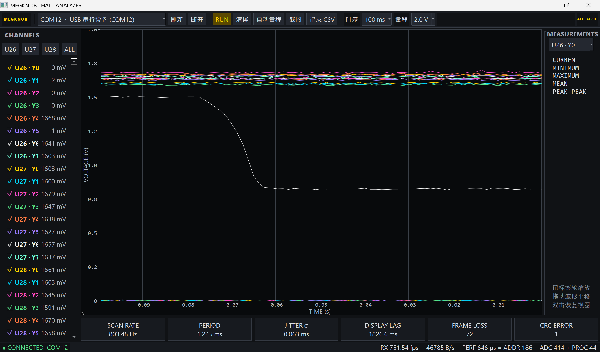

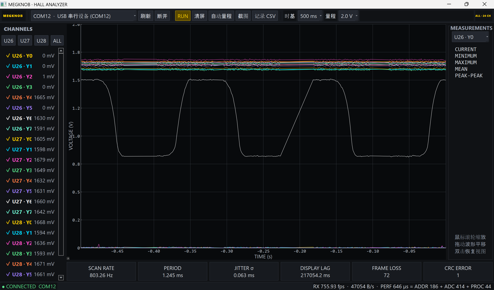

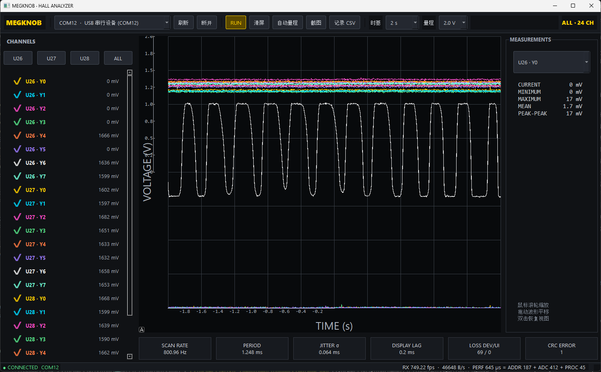

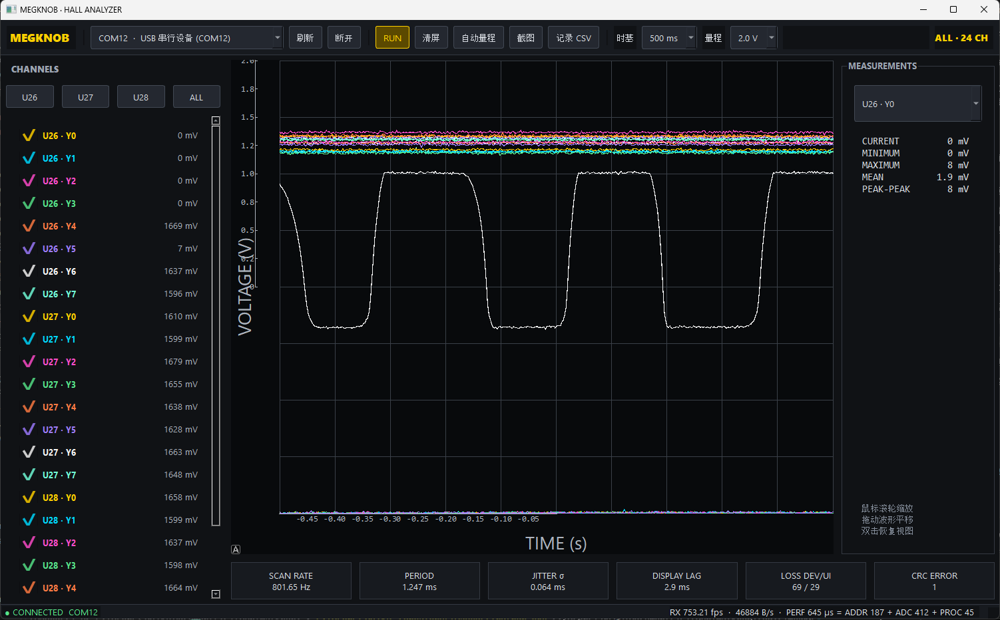

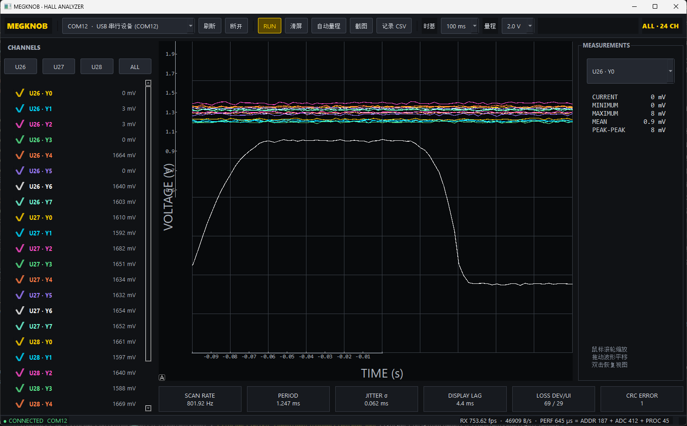

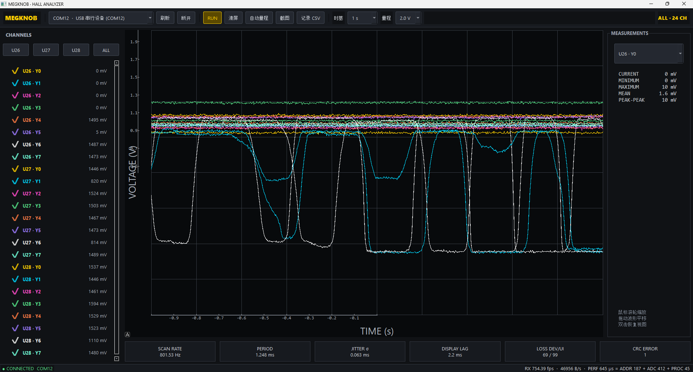

## 2026-07-20：冲击 1000 Hz，第一阶段

上一版本为 695 Hz，完整扫描周期约 1.44 ms。1000 Hz 要求周期不超过 1.00 ms，需要减少约 0.44 ms。

已完成修改：

1. 协议升级到微秒时间戳，并使用 Cortex-M4 DWT 计时；
2. 每 256 次扫描发送 performance frame，记录 `scan/address/adc/process`；
3. acquisition time 从默认 10 µs 改为 5 µs；
4. settle time 从 30 µs 改为 20 µs；
5. 地址顺序改为 `0 → 1 → 3 → 2 → 6 → 7 → 5 → 4`，相邻地址只翻转一个 GPIO；
6. 上位机增加设备端分段性能显示。

固件构建成功，最终设备树确认 settle 为 20 µs、acquisition 为 5 µs，UF2 大小 135168 bytes。

## 2026-07-23：BLE Controller 与构建目标收敛

MegKnob 的实际 MCU 目标一直是 `nice!nano v2`，核心芯片为 nRF52840。为补齐 BLE 协议栈，`megknob.conf` 显式启用了 `CONFIG_BT_CTLR=y`：`CONFIG_ZMK_BLE` 负责 ZMK BLE HID，`CONFIG_BT` 负责 Zephyr Host，`CONFIG_BT_CTLR` 负责 Link Layer、PHY 与 nRF 无线电控制。

后续 Build workflow 曾自动生成 `MegKnob + RP2040` 等无关组合。根因不是产品使用了 RP2040，而是硬件元数据中的 `requires: [pro_micro]` 只表达插针互连兼容；CI 将它解释为应与所有暴露 `pro_micro` 互连的控制器进行笛卡尔积构建。MegKnob overlay 使用 Nordic 专用 `NRF_PSEL`、SAADC 与 nRF pinctrl，因而这些组合没有产品意义。

本次修正：

1. 保留 `requires: [pro_micro]` 表达物理接口，但在元数据描述中明确目标为 `nice!nano v2 (nRF52840)`；
2. Build matrix 对 MegKnob 仅生成 `nice_nano//zmk` 组合；
3. BLE Know-How 视频改为解释真实硬件栈，不再把 CI 误生成的 MCU 当成产品设计的一部分；
4. Windows 本地构建默认目标仍为 `nice_nano_v2`。

工程结论：连接器兼容不等于 MCU 兼容。对使用 SoC 专有 DeviceTree 宏和外设的 shield，CI 构建目标必须显式收敛到实际支持的控制器。

## 2026-07-19：500 Hz 目标完成

最终实测完整 24 通道扫描率达到 **695 Hz**，平均扫描周期约：

```text
1000 / 695 ≈ 1.44 ms
```

已经超过原定 500 Hz 目标约 39%。后续不再单纯追求空载扫描率，优先验证模拟质量、端到端延迟和磁轴算法稳定性。

本轮优化过程：

1. 初始基线 83.170 Hz：settle 500 µs、polling 5 ms，每通道一次 dummy read 加一次正式 read；
2. 重新焊接 U28，解决其公共端 Z 始终为 0 V 的硬件故障；
3. 逐步缩短轮询与 settle，并取消 dummy read；
4. 扫描任务移至独立工作队列；
5. 从每帧 24 次独立 `adc_read()` 优化为 8 次三通道 batch read；
6. 上位机从逐帧 Qt signal 改为有界共享队列、批量取帧、积压丢旧帧并限制绘图点数；
7. 将几十微秒延时从 `k_usleep()` 改为 `k_busy_wait()`，最终达到 695 Hz。

### UF2 刷写现象

复制完成后 bootloader 会立即重启，虚拟 U 盘消失。Windows 有时提示“无法复制”，有时不提示，两种情况都可能已成功刷写。应以 bootloader 盘消失、COM 端口重新出现、上位机恢复接收和新行为生效为判断标准。

原始优化截图：

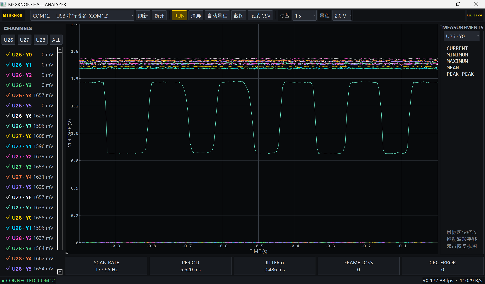

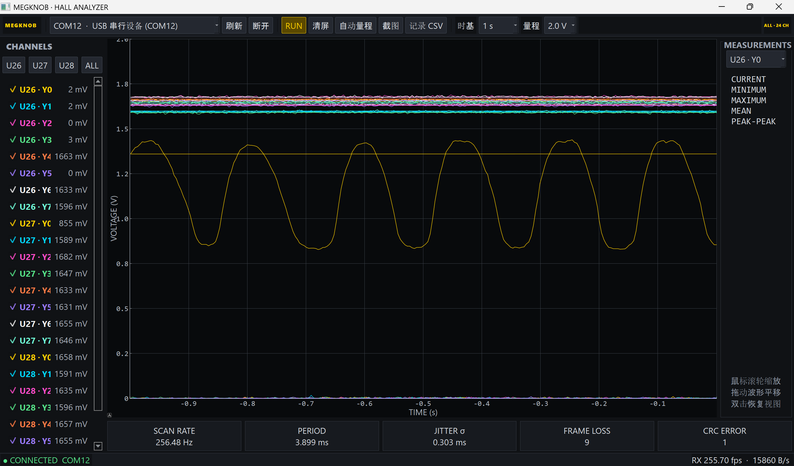

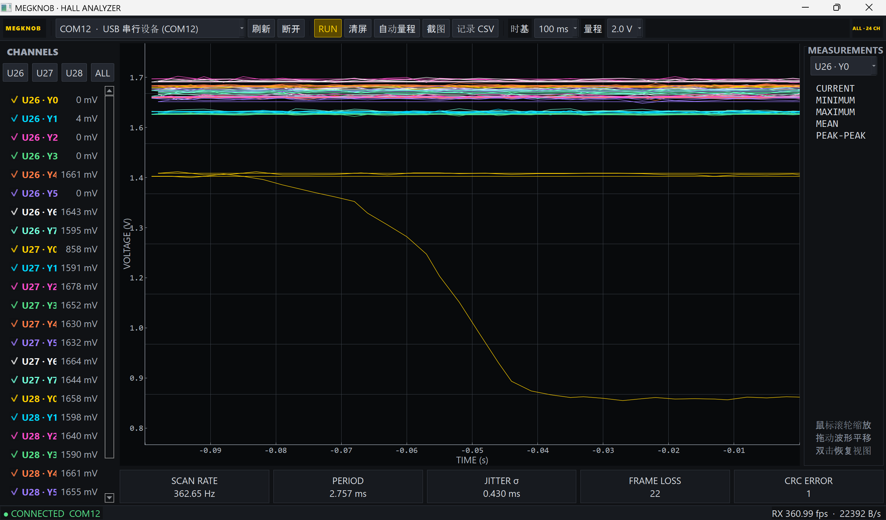

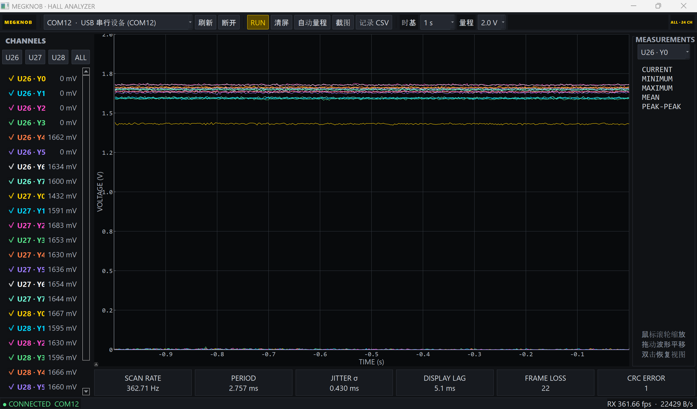

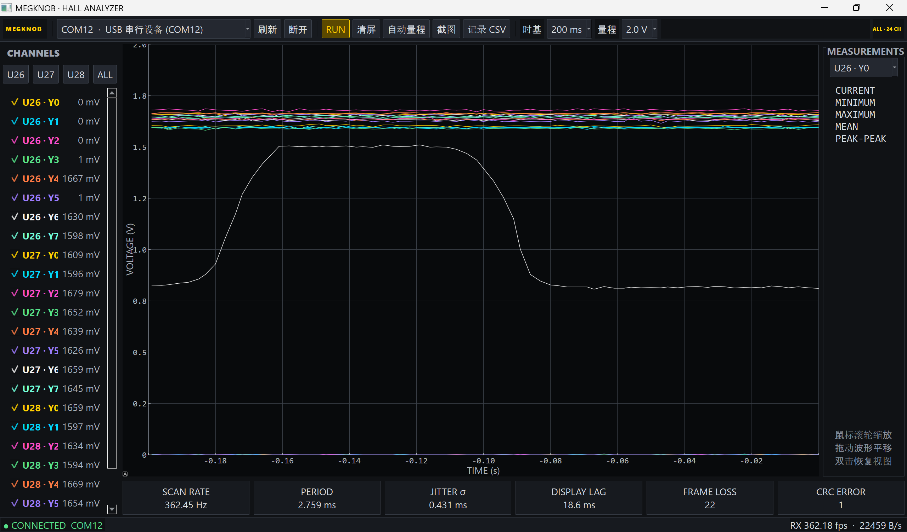

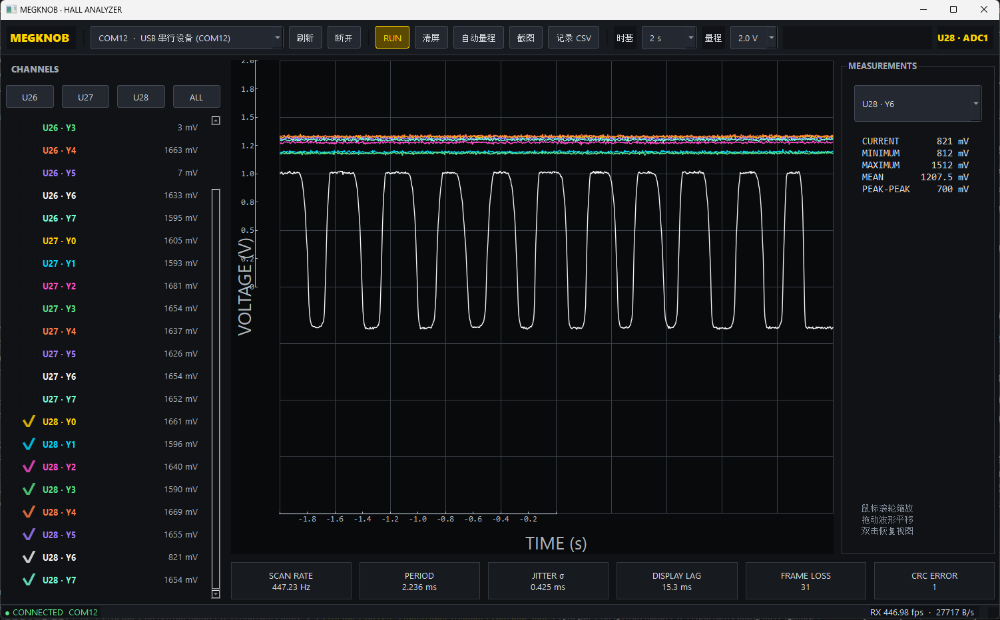

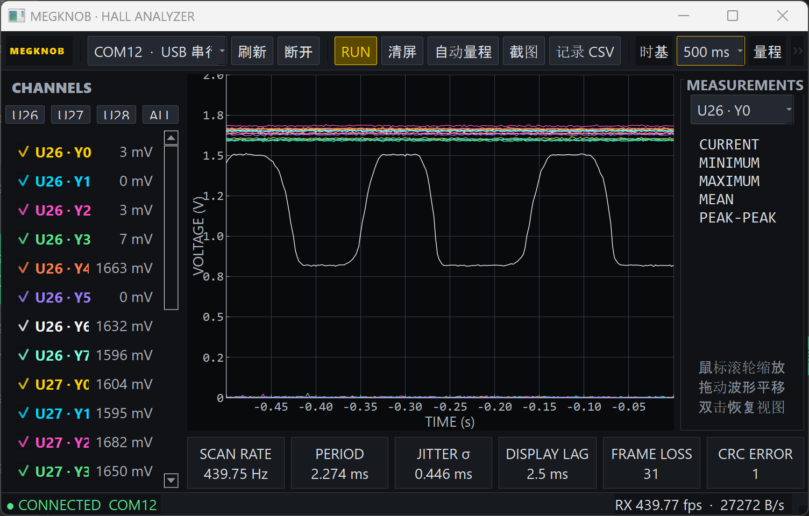

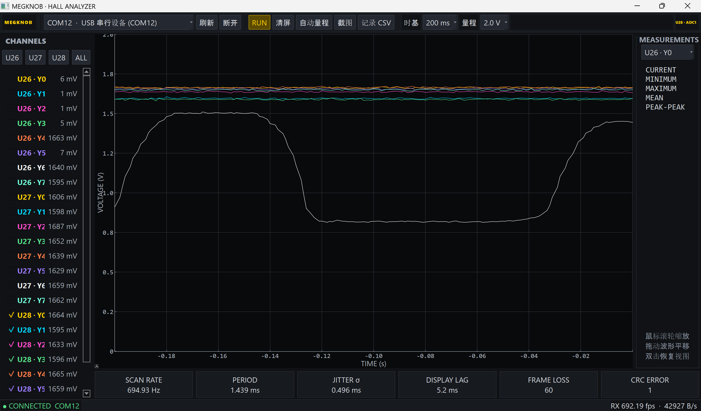

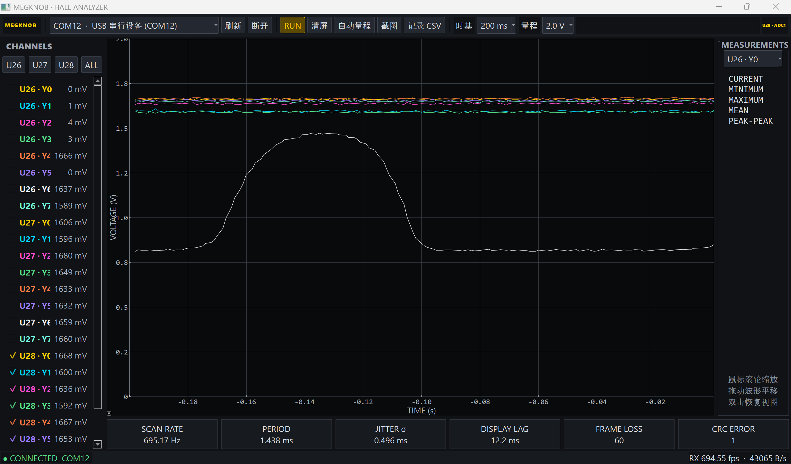

## 2026-07-19：24 路采集性能基线

测试条件：COM12、USB CDC ACM、统计 30.059 s、settle 500 µs、polling 5 ms、每路一次 dummy read 与一次正式 read、每帧 62 bytes、CRC-16/CCITT-FALSE。

| 指标 | 实测结果 |
|---|---:|
| 有效数据帧 | 2499 |
| 下位机扫描频率 | 83.170 Hz |
| 上位机接收帧率 | 83.137 fps |
| 平均完整扫描周期 | 12.0235 ms |
| 最短周期 | 11 ms |
| 最长周期 | 13 ms |
| 周期抖动标准差 | 0.158 ms |
| 协议序号检测丢帧 | 0 |
| CRC 错误 | 0 |
| 平均串口吞吐量 | 5156 B/s |

该组数据作为后续 settle time 修改的 baseline。软件统计证明传输链路稳定，但当时尚未统计模拟离群点。

## 2026-07-19：U28 故障定位与返修

### 现象

- U26 Y6、Y7 曾在真实电压与 0 V 之间频繁跳变；
- ADC3 一组的 MEG4、MEG9、MEG14 靠近磁铁时没有波形变化；
- U28 各 Y 输入约 1.6 V，但公共输出 Z 为 0 V。

原始截图：

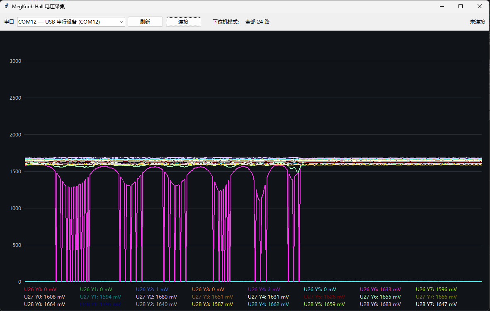

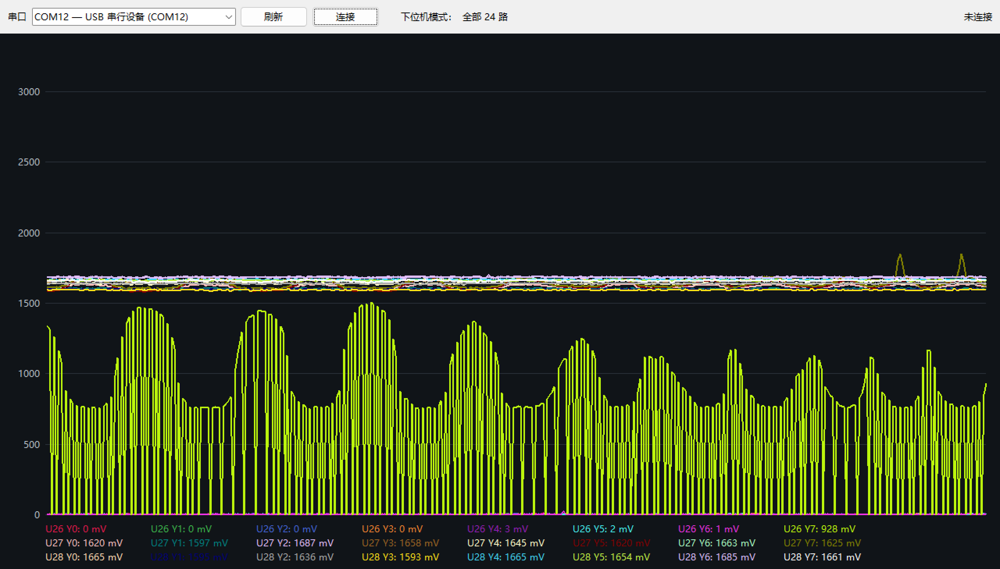

### 结论

重新焊接 U28 后问题解决，根因在 U28 芯片或焊接连接，不是 ADC 阈值、扫描映射或地址建立时间。

按现象推断，可疑焊点优先级为：

1. `Z/COM` 引脚虚焊或走线接触不良；
2. `VCC` 虚焊；
3. `E` 未可靠保持低电平，使 Z 进入高阻；
4. `GND/VEE` 公共焊点虚焊。

地址 A/B/C 单点虚焊通常造成选错或随机选通，不太容易在所有 Y 输入相近时稳定产生“Z 始终为 0 V”。
